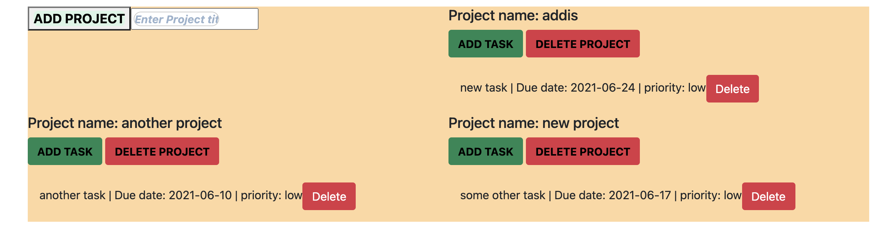

# Todo-Collab

Creating a To Do list in using Javascript to create and maintain list of tasks for better time management

## Todolist screenshot

In this project we build a To Do list app with vanilla javascript & webpack where you can:

- Create new lists
- Add Tasks

## Built With

- JavaScript
- HTML
- CSS
- Webpack

## Getting Started

To set up a local copy of the project

- `git clone git@github.com:Emmyn5600/Todo-App.git`
- `cd Todo-App`
- `git pull origin todos_feature`

If you want to repack the file

- Run `npm install` on the terminal to install dependancies
- Run `npx webpack` to bundle the files in the src folder & product ouput in dist folder

  or

- Go to the dist folder and open index.html

## Live Link of the project

[Live-Link](https://emmyn5600.github.io/Todo-App/)

## Author

👤 **Addis Belete**

- GitHub: [@Addis0943](https://github.com/Addis0943)
- Twitter: [@Addis32018084](https://twitter.com/Addis32018084)
- LinkedIn: [LinkedIn](https://www.linkedin.com/in/addis-belete-134b98191/)

👤 **NSABIMANA Emmanuel**

- GitHub: [@emmyn5600](https://github.com/Emmyn5600)
- Twitter: [@NSABIMA62253884](https://twitter.com/NSABIMA62253884)
- LinkedIn: [@nsabimana-emmanuel-4276091b2](https://www.linkedin.com/in/nsabimana-emmanuel-4276091b2/)

## 🤝 Contributing

Contributions, issues, and feature requests are welcome!

## Show your support

Give a ⭐️ if you like this project!

## Acknowledgments

- Thanks to Odin project for the tutorials.

## 📝 License

This project is [MIT](LICENSE) licensed.
